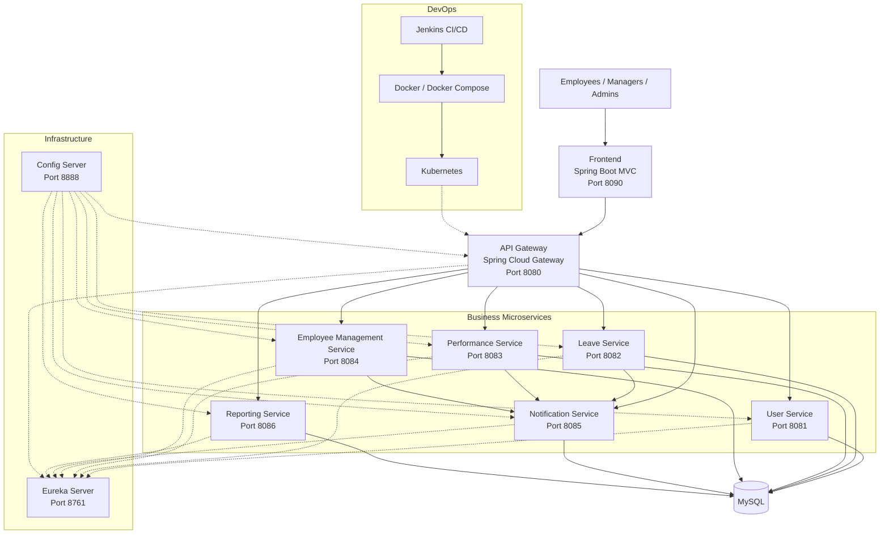

# RevWorkforce HRM Platform

A cloud-native Human Resource Management (HRM) platform built using **Java, Spring Boot, Spring Cloud, MySQL, Docker, and Kubernetes**.

## Overview

RevWorkforce provides employee management, user authentication, leave management, performance management, reporting, and notifications through a **microservices architecture**.

## Architecture

The platform consists of independent microservices supported by:

- API Gateway
- Eureka Service Discovery
- Spring Cloud Config Server
- MySQL
- Docker & Kubernetes
- Jenkins CI/CD

## System Architecture

### Architecture Overview

RevWorkforce follows a cloud-native microservices architecture. The frontend communicates with the backend through the API Gateway, which routes requests to six independent business microservices.

- **User Service** – authentication, authorization and user profiles
- **Leave Service** – leave applications, balances, approvals and holidays
- **Performance Service** – reviews, goals and manager feedback
- **Employee Management Service** – employees, departments, designations and announcements
- **Notification Service** – employee and manager notifications
- **Reporting Service** – HR dashboards and organizational reports

**Eureka Server** provides service discovery, while **Config Server** centralizes configuration. Each business service maintains its own data boundaries. Docker, Kubernetes and Jenkins provide the containerization, orchestration and CI/CD layers.

## Microservices

- User Service
- Leave Service
- Performance Service
- Employee Management Service
- Reporting Service
- Notification Service

## Tech Stack

**Java 17 | Spring Boot | Spring Cloud | Spring Data JPA | MySQL | Maven | Docker | Kubernetes | Jenkins | Git**

## Team

Developed as a team project using GitHub feature branches, pull requests, code reviews, and controlled merges into the `main` branch.

## Team Contribution

- Yash — Employee Management Service
- Aryan — User Service, Reporting Service, Infrastructure and Integration
- Branson — Leave Service and Notification Service
- Ivan — Performance Service
<!-- Auto CI/CD Webhook Triggered -->
